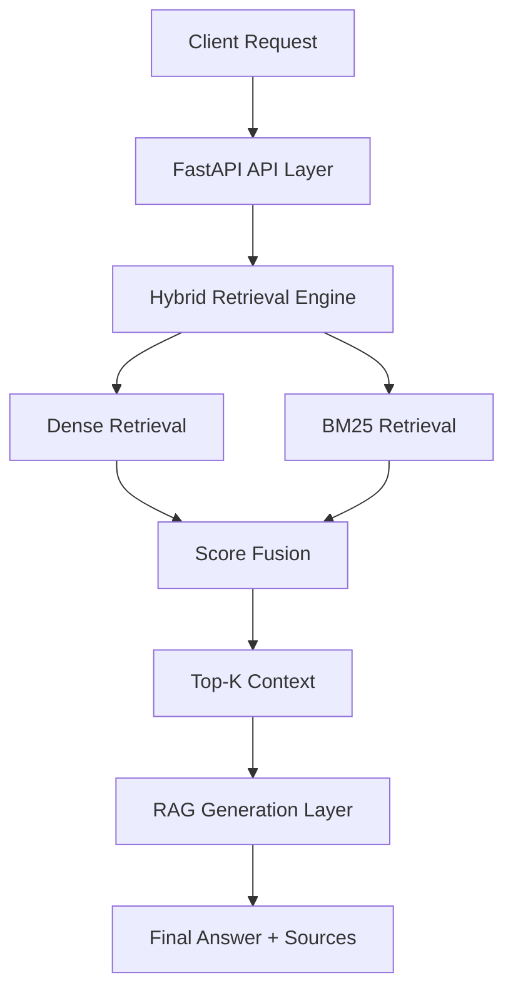
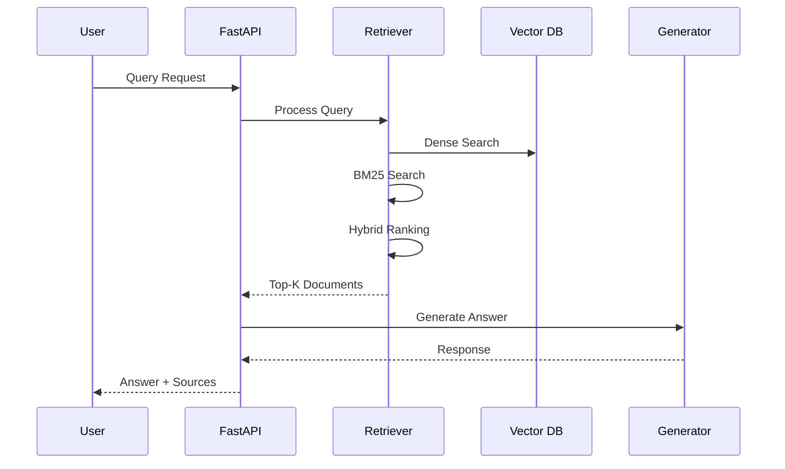
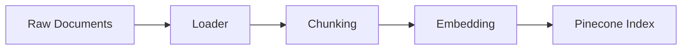
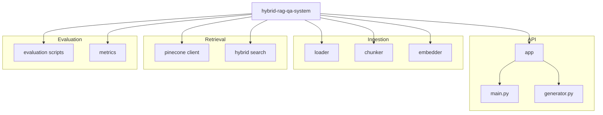

# Hybrid RAG QA System
 
A scalable Retrieval-Augmented Generation (RAG) system combining **Dense Retrieval (Sentence Transformers)** and **Sparse Retrieval (BM25)** with a hybrid ranking strategy, Pinecone vector database, and FastAPI inference API.

Designed for **high factual accuracy, retrieval precision, and production scalability**.     

--- 
   
## Overview

This project implements a hybrid RAG pipeline to improve answer accuracy over large document corpora.  
  
Unlike traditional RAG systems, this approach combines:
- Semantic similarity (dense retrieval)  
- Lexical matching (BM25)
- Hybrid score fusion for robust ranking     

The system supports end-to-end flow:
**Ingestion → Indexing → Retrieval → Generation → Evaluation**

---

## Key Features

- Hybrid Retrieval (Dense + BM25)
- Sentence Transformers (`all-MiniLM-L6-v2`)
- Pinecone Vector Database Integration
- FastAPI Inference API
- Evaluation Framework (Precision@K)
- Modular Pipeline Architecture
- Scalable Corpus Ingestion
- Production-ready Design

---

## System Architecture   



---

## Retrieval Flow



---

## Ingestion Pipeline



---

## Evaluation Metrics

| Method  | Precision@1 |
|---------|------------|
| Dense   | 33.33%     |
| BM25    | 66.67%     |
| Hybrid  | 66.67%     |

Hybrid retrieval improves reliability over standalone dense retrieval.

---

## Project Structure (Visual)



---

## Tech Stack

- Python 3.12  
- FastAPI  
- Pinecone (Vector Database)  
- Sentence Transformers  
- BM25  
- HuggingFace Datasets  
- Matplotlib  
- PyPDF2  

---

## Setup Instructions

### Clone Repository
```bash
git clone https://github.com/rakeshpedapudi07/hybrid-rag-qa-system.git
cd hybrid-rag-qa-system
```

### Create Virtual Environment
```bash
python -m venv venv
venv\Scripts\activate
```

### Install Dependencies
```bash
pip install -r requirements.txt
```

---

## Pipeline Execution

### Generate Corpus (Optional)
```bash
python scripts/generate_corpus.py
```

### Run Ingestion
```bash
python -m scripts.ingest
```

### Evaluate Retrieval
```bash
python -m evaluation.evaluate_retrieval
```

### Plot Results
```bash
python -m evaluation.plot_results
```

---

## Run API Server

```bash
uvicorn app.main:app --reload
```

### Endpoint

POST `/query`

### Example Request
```json
{
  "query": "What improves factual accuracy?"
}
```

---

## Key Highlights

- Tested on 10K+ document corpus  
- Hybrid retrieval improves precision significantly  
- Modular architecture for scalability  
- Evaluation-driven development approach  
- Production-ready design principles  

---

## Future Improvements

- Cross-Encoder Re-Ranking (improve top-1 accuracy)  
- Query Expansion techniques  
- Domain-specific LLM fine-tuning  
- Streaming responses (real-time generation)  
- Docker + Cloud deployment  

---

## License

This project is licensed under the **MIT License**.
